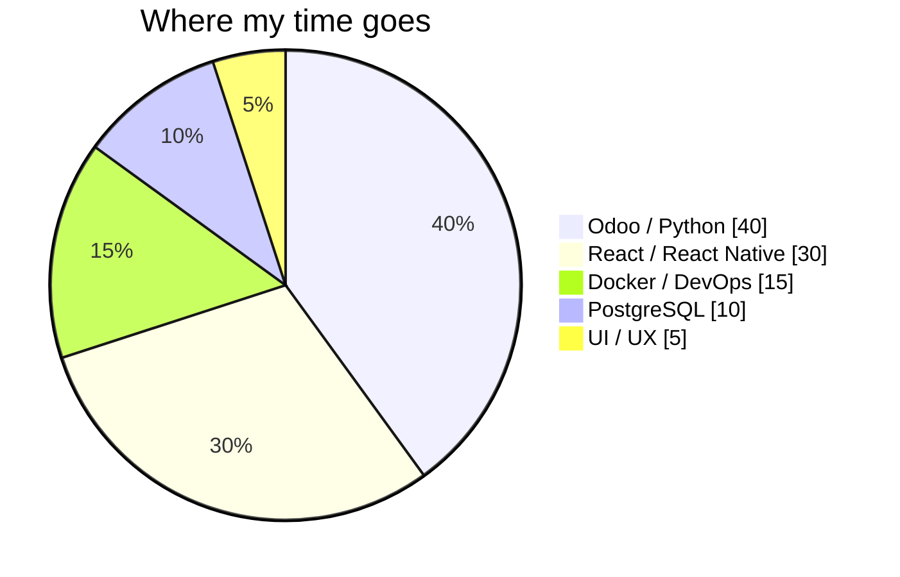
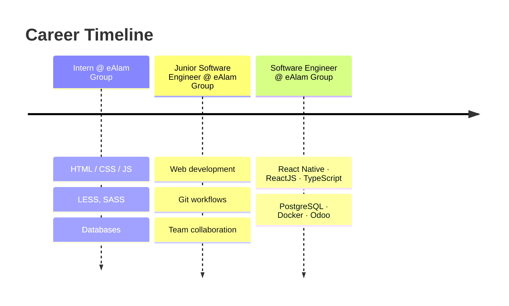

<div align="center">


<a href="https://git.io/typing-svg">
  
</a>

<br/>

[](https://www.linkedin.com/in/sami-ullah-khattak-3a400625a/)
[](https://www.upwork.com)
[](mailto:samiulahktk@gmail.com)
[](https://instagram.com/samiiktk)
[](https://www.facebook.com/04467565kjhj/)


</div>


## 👨‍💻 About Me

```python
class SamiUllahKhattak:
    role       = "Software Engineer @ eAlam Group"
    location   = "Islamabad, Pakistan 🇵🇰"
    experience = "3+ years building production web & mobile apps"

    focus      = ["Odoo ERP", "QWeb Reports", "Custom Workflows", "Docker Deployments"]
    also_builds = ["React", "React Native", "TypeScript", "Flask APIs"]

    philosophy = "Clean code. Solid UX. Systems that scale."

    def journey(self):
        return "HTML/CSS → React → Odoo → Dockerized ERPs 🐳"
```

Started as a UI developer, grew into application architecture. Today I build **Odoo modules, QWeb reports, and automated business workflows**, and I deploy them with Docker.

<br/>

<table>
<tr>
<td width="50%" valign="top">

### 🔭 Current Status

| | |
|---|---|
| 🛠️ **Working on** | Odoo modules & custom QWeb views |
| 📖 **Learning** | Odoo ORM, wizards, report generation |
| 🤝 **Open to** | Odoo & ERP collaborations |
| 🆘 **Need help with** | Advanced QWeb templating |
| 💬 **Ask me about** | ERP, React / React Native, UI architecture |
| ⚡ **Fun fact** | Started with HTML/CSS, ended up containerizing ERPs |

</td>
<td width="50%" valign="top">

### 🎯 2026 Goals

- [x] Ship production Odoo modules
- [x] Containerize Odoo with Docker Compose
- [ ] Master QWeb & custom PDF reports
- [ ] Publish open-source Odoo addons
- [ ] Finish B.Sc. Computer Science
- [ ] Write technical posts on ERP dev

</td>
</tr>
</table>


## 🧰 Tech Stack

<div align="center">

**Frontend**<br/>
<br/>
<sub>React · TypeScript · JavaScript · HTML5 · CSS3 · Sass · Bootstrap &nbsp;|&nbsp; React Native for mobile</sub>

<br/><br/>

**Backend & Data**<br/>

<br/>
<sub>Python · Flask · PostgreSQL · Odoo (ORM, QWeb, wizards, reports)</sub>

<br/><br/>

**DevOps & Tools**<br/>
<br/>
<sub>Docker · Docker Compose · Git · GitHub · Linux · Nginx · Postman · VS Code</sub>

</div>

<br/>

### 📊 Skill Focus




## 🧪 Code I Enjoy Writing

A small Odoo model with a computed field and a workflow action, the kind of thing I build every day:

```python
from odoo import models, fields, api


class SaleApproval(models.Model):
    _name = "sale.approval"
    _description = "Sale Approval Request"
    _inherit = ["mail.thread"]

    name = fields.Char(required=True, tracking=True)
    amount = fields.Monetary(currency_field="currency_id")
    currency_id = fields.Many2one("res.currency", default=lambda s: s.env.company.currency_id)
    state = fields.Selection(
        [("draft", "Draft"), ("review", "In Review"), ("approved", "Approved")],
        default="draft", tracking=True,
    )
    is_high_value = fields.Boolean(compute="_compute_high_value", store=True)

    @api.depends("amount")
    def _compute_high_value(self):
        for rec in self:
            rec.is_high_value = rec.amount > 10000

    def action_submit(self):
        self.write({"state": "review"})
        self.message_post(body="Submitted for approval 🚀")
```

And the deployment side:

```yaml
# docker-compose.yml
services:
  odoo:
    image: odoo:20
    depends_on: [db]
    ports: 127.0.0.1:${ODOO_EXT_PORT}:8069"
    volumes:
      - ./addons:/mnt/extra-addons
      - odoo-data:/var/lib/odoo
  db:
    image: postgres:18
    env_file:
      - .env
    environment:
      POSTGRES_DB: ${POSTGRES_DB}
      POSTGRES_USER: ${POSTGRES_USER}
      POSTGRES_PASSWORD: ${POSTGRES_PASSWORD}
volumes:
  odoo-data:
```


## 💼 Experience



| Period | Role | Company | Stack |
|:--|:--|:--|:--|
| **2 yrs 7 mos** *(current)* | Software Engineer | **eAlam Group** | React Native · ReactJS · TypeScript · PostgreSQL · Docker · Odoo |
| 6 mos | Junior Software Engineer | eAlam Group | Web development · Git workflows · Team collaboration |
| 8 mos | Intern | eAlam Group | HTML/CSS/JS · LESS · SASS · Databases |
| **4 yrs** *(ongoing)* | UI Developer (Freelance) | **Upwork** | React.js · JavaScript · UI/UX for diverse clients |
| 6 mos | Computer Programmer | IMMS | React.js · React Native |

## 🎓 Education

| | |
|:--|:--|
| 📚 **B.Sc. Computer Science** *(in progress)* | Alhamd Islamic University, Islamabad · Nov 2023 – Feb 2027 · C++, OOP, Data Structures |
| 🎓 **Pre-Medical** · Grade A | Ummah Children Academy · 2011 – 2022 |


## 📈 GitHub Stats

<div align="center">


</div>

### 🐍 Contribution Snake

<div align="center">
<picture>
  <source media="(prefers-color-scheme: dark)" srcset="https://raw.githubusercontent.com/Sami-Ullah-Khattak/Sami-Ullah-Khattak/output/github-snake-dark.svg" />
  <source media="(prefers-color-scheme: light)" srcset="https://raw.githubusercontent.com/Sami-Ullah-Khattak/Sami-Ullah-Khattak/output/github-snake.svg" />
  
</picture>
</div>

### 🏆 Trophies

<div align="center">


</div>


## 💡 Dev Wisdom

<div align="center">


</div>

## 🤝 Let's Work Together

> 💬 Reach out if you're working on **Odoo / ERP**, need a **React or React Native** developer, or want to collaborate on something interesting.

<div align="center">

| 🧩 Odoo Module Development | 📄 QWeb & PDF Reports | 🐳 Docker Deployments | 📱 React Native Apps |
|:--:|:--:|:--:|:--:|
| Custom apps, workflows, automation | Invoices, labels, custom layouts | Odoo + PostgreSQL + Nginx setups | Cross-platform mobile UIs |

<br/>

[](https://www.linkedin.com/in/sami-ullah-khattak-3a400625a/)
[](mailto:samiulahktk@gmail.com)
[](https://www.upwork.com)

</div>


<div align="center">
<sub>Built with precision · Islamabad, Pakistan 🇵🇰</sub>
</div>
